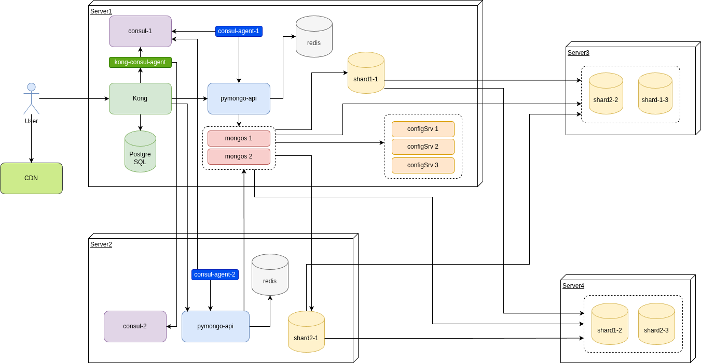

# Задания 1-6

Финальная версия архитектуры выглядит следующим образом.



Файл [draw.io](planning/task6.drawio) со схемой.


### Как запустить

Запускаем mongodb и приложение из дирректории *sharding-repl-cache*.

```shell
docker compose up -d
```

Настраиваем кластер

```shell
./scripts/init-cluster.sh
```

Заполняем mongodb данными

```shell
./scripts/mongo-init.sh
```

# 7. Проектирование схем коллекций для шардирования данных

## Описание коллекций

### Orders

#### Коллекция

    {
      _id: ObjectId,
      user_id: ObjectId,
      order_date: Date,
      items: [ // список товаров
        {
          product_id: ObjectId,
          product_name: String,
          price: Number,
          quantity: Number,
          category: String
        }
      ],
      status: String, // статус заказа
      total_amount: Number, // общая сумма
      geozone: String,
      created_at: Date,
      updated_at: Date
    }

#### Шардирование

*Стратегия:* Ranged Sharding

        sh.shardCollection("somedb.orders", { "user_id": 1, "order_date": -1, "geozone": 1})

*Обоснование:*

- локализация данных пользователя на одном шарде (быстрее создавать/изменять заказ, т.к. данные пользователя физически рядом);
- проще искать заказы пользователя (т.к. данные пользоватля физически на одном сервере);
- заказы из одного региона находятся на одном и том же шарде.

Создание разных географических регионов:

        sh.addShardToZone("shard1rs/shard1-1:27017", "moscow")
        sh.addShardToZone("shard1rs/shard2-1:27017", "peter")
        sh.addShardToZone("shard1rs/shard3-1:27017", "ekb")
        

Привязываем данные из одного региона к одному и тому же шарду:

    sh.updateZoneKeyRange(
      "somedb.orders",
      {geozone: "moscow", user_id: MinKey},
      {geozone: "moscow", user_id: MaxKey}, 
      "moscow"
    )

    sh.updateZoneKeyRange(
      "somedb.orders",
      {geozone: "peter", user_id: MinKey},
      {geozone: "peter", user_id: MaxKey},
      "peter"
    )
    sh.updateZoneKeyRange(
      "somedb.orders",
      {geozone: "ekb", user_id: MinKey}, 
      {geozone: "ekb", user_id: MaxKey},
      "ekb"
    )

### Products

    {
      _id: ObjectId,
      name: String,
      category: String,
      price: Number,
      
      stock: { // остатки по геозонам
        "moscow": Number,
        "peter": Number,
        "ekb": Number
      },
      
      attributes: { // дополнительные атрибуты
        color: String,
        size: String,
        brand: String
      },
      
      created_at: Date,
      updated_at: Date
    }


#### Шардирование

*Стратегия:* Hashed Sharding

    sh.shardCollection("somedb.products", { "category": "hashed" })

*Обоснование:*

- Поиск быстрее т.к. товары одной категории на одном и том же шарде;
- Эффективная фильтрация по категориям и ценам.


### Carts

    {
      _id: ObjectId,
      user_id: ObjectId,
      session_id: String,
      items: [
        {
          product_id: ObjectId,
          quantity: Number,
          added_at: Date
        }
      ],
      status: String, // "active" | "ordered" | "abandoned"
      created_at: Date,
      updated_at: Date,
      expires_at: Date
    }


Автоматическая очистка корзин старше 30 дней:

    db.carts.createIndex(
      { "updated_at": 1 }, 
      { 
        expireAfterSeconds: 2592000, // 30 дней
        partialFilterExpression: { "status": { $in: ["abandoned", "ordered"] } }
      }
    )

#### Шардирование

*Стратегия:* Hashed Sharding

    sh.shardCollection("somedb.orders", { "user_id": 1, "order_date": -1 })
    sh.shardCollection("somedb.carts", { "session_id": "hashed" })

*Обоснование*:

- Равномерное распределение корзин по шардам;
- Быстрый доступ к активным корзинам по session_id/user_id.


# 8. Выявление и устранение «горячих» шардов

## Поиск неоптимального распределения данных

Все операции по исследованию шардов проводим на БД *config*:

    use config
    
Следующие команды помогут определить, наколько оптимально распределены данные. В случае сильных перекосов в сторону одного из шардов следует исправлять распределение данных.

### Метрика: распределение чанков по шардам

    db.chunks.aggregate([
      { $group: { _id: "$shard", total: { $sum: 1 } } },
      { $sort: { total: -1 } }
    ])

### Метрика: размер данных на каждом шарде

    db.adminCommand({ listDatabases: 1 })


### Метрика: количество документов в разных шардах

    db.chunks.countDocuments({shard: 'shard1rs'})
    db.chunks.countDocuments({shard: 'shard2rs'})

## Устранение проблем с неоптимальным распределением данных


### Балансировщик должен быть включен

    sh.startBalancer()

Через некоторое время балансировщик перераспределит данные между шардами более оптимальным способом

### Пересмотр стратегии шардирования

Возможно есть смысл изменить параметры шардирования коллекций, например, добавить зоны шардирования, как это сделано в предыдущем задании для коллекции *orders*.


# 9. Настройка чтения с реплик и консистентность

| Коллекция | Операция чтения                            | Primary/Secondary | Допустимая задержка | Обоснование                                            |
|-----------|--------------------------------------------|-------------------|---------------------|--------------------------------------------------------|
| orders    | Создание заказа                            | Только Primary    | до 1 секунды        | Консистентность и избежание дублирования               |
| orders    | Статус текущего заказа                     | Только Primary    | до 1 секунды        | Пользователь должен видеть актуальный статус           |
| orders    | Обновление статуса заказа                  | Только Primary    | до 1 секунды        | Актуальный статус должен быть сразу везде              |
| orders    | Детали заказа для пользователя             | Secondary         | до 3 секунд         | Заказ редко меняет свой статус, может читаться из кэша |
| orders    | Детали заказа для службы доставки          | Secondary         | до 30 секунд        | Не критично для логистики                              |
| orders    | История заказов пользователя               | Secondary         | до 10 секунд        | История не требует мгновенной актуальности             |
| orders    | Поиск заказов (админка)                    | Secondary         | до 15 секунд        | Для аналитики допустима небольшая задержка             |
| products  | Получение каталога товаров                 | Secondary         | до 3 секунд         | Каталог может быть немного устаревшим                  |
| products  | Поиск товаров по фильтрам                  | Secondary         | до 5 секунд         | Данные о наличии могут быть неактуальными              |
| products  | Страница товара (детальная)                | Secondary         | до 3 секунд         | Пользователь видит основную информацию                 |
| products  | Проверка остатков при добавлении в корзину | Только Primary    | до 1 секунды        | Критично для предотвращения oversell                   |
| products  | Списание остатков при заказе               | Только Primary    | до 1 секунды        | Нужно избежать oversell                                |
| carts     | Добавление товара в корзину                | Только Primary    | до 1 секунды        | Корзина должна быть консистентной                      |
| carts     | Удаление товара из корзины                 | Только Primary    | до 1 секунды        | Корзина должна быть консистентной                      |
| carts     | Обновление корзины                         | Только Primary    | до 1 секунды        | Изменения должны быть сразу видны                      |
| carts     | Получение корзины пользователя             | Только Primary    | до 1 секунды        | Корзина часто меняется, нужны актуальные данные        |
| carts     | Просмотр корзины перед оформлением         | Только Primary    | до 1 секунды        | Должны быть актуальные цены и наличие                  |


# Миграция на Cassandra: модель данных, стратегии репликации и шардирования

## Задание 10.1

Оставить в MongoDB:

- Остатки товаров (инвентарь)
- Создание и обработка заказов
- Финансовые транзакции

Перенести в Cassandra:

- Корзины покупок
- Пользовательские сессии
- Каталог товаров
- История заказов (чтение)
- Аналитика и логи

Такой подход обеспечит максимальную производительность в "Черную пятницу" для высоконагруженных компонентов, сохраняя целостность критически важных бизнес-данных в MongoDB.


| Тип данных              | Критичность целостности | Критичность скорости | Рекомендация          | Обоснование                                                                            |
|-------------------------|-------------------------|----------------------|-----------------------|----------------------------------------------------------------------------------------|
| Остатки товаров         | ВЫСОКАЯ                 | ВЫСОКАЯ              | Оставить в MongoDB    | Требует сильной консистентности для предотвращения oversell, транзакционные обновления |
| Создание заказов        | ВЫСОКАЯ                 | СРЕДНЯЯ              | Оставить в MongoDB    | Требует ACID транзакций, финансовая точность, списание остатков + создание заказа      |
| Корзины покупок         | СРЕДНЯЯ                 | ВЫСОКАЯ              | Перенести в Cassandra | Быстрая запись, частая доступность, допустима временная несогласованность              |
| Пользовательские сессии | НИЗКАЯ                  | ВЫСОКАЯ              | Перенести в Cassandra | Низкая latency, горизонтальное масштабирование, встроенная поддержка TTL               |
| Каталог товаров         | СРЕДНЯЯ                 | ВЫСОКАЯ              | Перенести в Cassandra | Высокий read-traffic, геораспределенность, быстрый поиск по категориям                 |
| История заказов         | НИЗКАЯ                  | СРЕДНЯЯ              | Перенести в Cassandra | Read-heavy нагрузка, архивные данные, естественное разделение по времени               |
| Аналитика просмотров    | НИЗКАЯ                  | СРЕДНЯЯ              | Перенести в Cassandra | Высокая throughput записи, eventual consistency допустима                              |

## Задание 10.2

### Корзины покупок (Carts)

    CREATE TABLE carts (
        user_id uuid,
        session_id text,
        cart_id uuid,
        items list<frozen<cart_item>>,
        status text,
        created_at timestamp,
        updated_at timestamp,
        expires_at timestamp,
        PRIMARY KEY ((user_id, session_id), cart_id)
    );
    Partition Key: (user_id, session_id)
   
*Обоснование:*

- Равномерное распределение по всем узлам (хеш от user_id + session_id)
- Все данные корзины пользователя в одной партиции

### Пользовательские сессии (Sessions)

    CREATE TABLE user_sessions (
        session_id text,
        user_id uuid,
        session_data text,
        created_at timestamp,
        last_activity timestamp,
        PRIMARY KEY (session_id)
    ) WITH default_time_to_live = 2592000;

*Обоснование:*

- Простой доступ по session_id
- Автоматическое TTL (30 дней)
- Равномерное распределение (если session_id генерируются случайно)

### Каталог товаров (Products)

    CREATE TABLE products (
        category text,
        product_id uuid,
        name text,
        price decimal,
        is_active boolean,
        attributes map<text, text>,
        PRIMARY KEY (category, product_id)
    );

*Обоснование:*

- Распределение по категориям (электроника, одежда и т.д.)
- Эффективный поиск по цене внутри категории
- Горячие категории (электроника) распределяются по разным узлам

### История заказов (Order History)

    CREATE TABLE order_history (
        user_id uuid,
        order_year int,
        order_date timestamp,
        order_id uuid,
        status text,
        total_amount decimal,
        items list<frozen<order_item>>,
        PRIMARY KEY ((user_id, order_year), order_date, order_id)
    ) WITH CLUSTERING ORDER BY (order_date DESC);

*Обоснование:*

- Распределение по пользователям и годам
- Эффективный доступ к истории заказов пользователя
- Естественное разделение данных по времени
- Избегаем неограниченного роста партиций


## Задание 10.3

| Сущность                | Hinted Handoff | Read Repair | Anti-Entropy | Обоснование                              |
|-------------------------|----------------|-------------|--------------|------------------------------------------|
| Корзины покупок         | Да             | Да          | Нет          | Доступность критична, данные временные   |
| Пользовательские сессии | Да             | Да          | Нет          | Сессии короткоживущие, доступность важна |
| Каталог товаров         | Да             | Да          | Да           | Часто читается, должна быть актуальной   |
| История заказов         | Нет            | Да          | Да           | Данные архивные, консистентность важна   |
